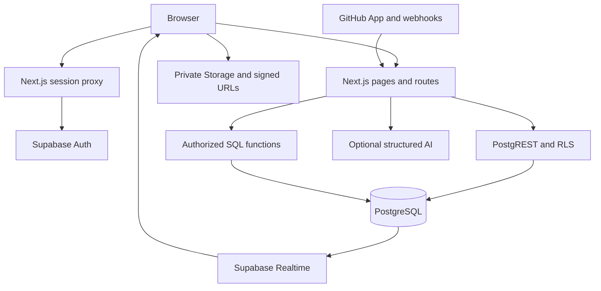

# TraceBox

TraceBox is an issue tracker for engineering teams. It keeps bug reports, triage decisions, code changes, release planning, and audit history in one place.

<p align="center">
  <a href="https://trace-box.vercel.app/"></a>
  <a href="https://github.com/ExistedYear/TraceBox/actions/workflows/ci.yml"></a>
  <a href="LICENSE"></a>
  
  
</p>

<p align="center"><strong><a href="https://trace-box.vercel.app/">Open TraceBox</a></strong></p>

## What it does

| Area | What you can do |
|---|---|
| Workspaces | Create private or public workspaces, invite people, discover open workspaces, and manage roles. |
| Projects | Create projects, components, labels, versions, milestones, templates, custom fields, and custom workflows. |
| Issues | Report, assign, edit, watch, search, filter, sort, link, bulk-update, and resolve issues. |
| Triage | Review new reports, use keyboard shortcuts, find duplicates, and apply suggested field changes. |
| Collaboration | Comment with Markdown, mention teammates, attach private files, and follow one activity timeline. |
| Planning | Track milestones and versions, view reports, export CSV data, and calculate release readiness. |
| Security | Restrict sensitive issues, grant access explicitly, use private attachments, and review immutable audit history. |
| GitHub | Connect a GitHub App, bind repositories, link pull requests, read checks, and process signed webhooks. |
| API | Use scoped bearer tokens with the `/api/v1` project, issue, comment, milestone, search, and GitHub endpoints. |
| Trace Intelligence | Score report quality, suggest triage, explain duplicates, parse search text, summarize release risk, and show dependency impact. |

Trace Intelligence is advisory. It never changes an issue without a person approving the change. Restricted and security issues are never sent to the external model.

## Main technology

- Next.js 16, React 19, and strict TypeScript
- Tailwind CSS and accessible Radix/shadcn-style components
- Supabase Auth, PostgreSQL, Row Level Security, Storage, and Realtime
- Groq structured output for optional Trace Intelligence features
- GitHub App APIs and signed webhooks
- Vitest, Playwright, pgTAP, ESLint, and GitHub Actions

## Requirements

- [Node.js 22 or newer](https://nodejs.org/)
- npm 10 or newer
- [Docker](https://docs.docker.com/get-docker/) for local Supabase
- [Supabase CLI](https://supabase.com/docs/guides/local-development/cli/getting-started), or permission for `npx` to download it
- Git

GitHub and Groq accounts are optional. The core issue tracker works without them.

## Start locally

### 1. Clone and install

```bash
git clone https://github.com/ExistedYear/TraceBox.git
cd TraceBox
npm install
```

### 2. Create the environment file

```bash
cp .env.example .env.local
```

Do not commit `.env.local`. The repository ignores every `.env*` file except `.env.example`.

### 3. Start and reset local Supabase

```bash
npm run db:start
npm run db:reset
```

`db:start` prints the local API URL, anon key, service-role key, database URL, and Studio URL. Copy these values into `.env.local`:

```dotenv
NEXT_PUBLIC_SUPABASE_URL=http://127.0.0.1:54321
NEXT_PUBLIC_SUPABASE_ANON_KEY=your-local-anon-key
SUPABASE_SERVICE_ROLE_KEY=your-local-service-role-key
```

The reset applies every migration and loads `supabase/seed.sql`.

### 4. Add optional variables

Leave a feature's variables blank if you do not use it.

```dotenv
GROQ_API_KEY=

GITHUB_WEBHOOK_SECRET=
GITHUB_APP_ID=
GITHUB_APP_SLUG=
GITHUB_APP_CLIENT_ID=
GITHUB_APP_CLIENT_SECRET=
GITHUB_APP_PRIVATE_KEY=
GITHUB_APP_CALLBACK_URL=http://localhost:3000/api/github/callback
GITHUB_API_VERSION=2022-11-28

CRON_SECRET=
```

| Variable | Required | Purpose |
|---|---:|---|
| `NEXT_PUBLIC_SUPABASE_URL` | Yes | Supabase API URL. Safe for browser code. |
| `NEXT_PUBLIC_SUPABASE_ANON_KEY` | Yes | Browser Supabase key. RLS still controls access. |
| `SUPABASE_SERVICE_ROLE_KEY` | Hosted server features | Server-only API, webhook, maintenance, and invitation email work. Never expose it to the browser. |
| `GROQ_API_KEY` | No | Server-only Trace Intelligence requests. |
| `GITHUB_WEBHOOK_SECRET` | No | Verifies GitHub webhook signatures. |
| `GITHUB_APP_ID` | No | GitHub App identity. |
| `GITHUB_APP_SLUG` | No | Builds installation links. |
| `GITHUB_APP_CLIENT_ID` | No | GitHub App authorization. |
| `GITHUB_APP_CLIENT_SECRET` | No | GitHub App authorization. Server-only. |
| `GITHUB_APP_PRIVATE_KEY` | No | Creates installation tokens. Store the full PEM using the format required by your host. |
| `GITHUB_APP_CALLBACK_URL` | No | Must match the callback configured in GitHub. |
| `GITHUB_API_VERSION` | No | GitHub REST API version. |
| `CRON_SECRET` | Hosted maintenance | Protects scheduled cleanup and reconciliation routes. |

### 5. Run the app

```bash
npm run dev
```

Open [http://localhost:3000](http://localhost:3000).

The local seed contains a disposable account:

```text
Email:    demo@123.com
Password: demo123
```

### Hosted demo account

The same credentials currently work on the [live TraceBox deployment](https://trace-box.vercel.app/). The account was provisioned as the owner of the public demo workspace and can modify its demo issues and settings; it has no intentional access to private tenants.

These credentials are public: anyone may sign in, change demo content, consume the account's ordinary application quota, or change its login details. Row Level Security limits the account to data it is authorized to access, and it has no service-role key or server credentials. Even so, do not store private information in the demo workspace, reuse this password elsewhere, connect sensitive repositories, or grant the account access to another workspace. Maintainers should treat all demo-account content as untrusted and reset the account if it is changed or abused.

### 6. Stop local Supabase

```bash
npm run db:stop
```

## Use a hosted Supabase project

1. Create a Supabase project.
2. Link it:

   ```bash
   npx supabase login
   npx supabase link --project-ref YOUR_PROJECT_REF
   ```

3. Check drift before writing:

   ```bash
   npx supabase migration list --linked
   npx supabase db push --linked --dry-run
   npx supabase db lint --linked --level error
   ```

4. Apply only pending forward migrations:

   ```bash
   npx supabase db push --linked
   npm run db:types:linked
   npm run sync:migrations
   ```

5. Set the three Supabase variables in `.env.local` and your deployment host.
6. Configure the Supabase Auth Site URL and allow callback, reset-password, and `/invite/**` redirects for localhost and the deployed domain.

Do not run `supabase/seed.sql` against production. A hosted demo account, when wanted, must be created separately as an ordinary user without privileged credentials or access to real tenant data.

`supabase/full_schema.sql` is kept on purpose. It is generated from the ordered migrations, supports fresh SQL Editor installs, and makes drift review easier. Never edit it directly; run `npm run sync:migrations` after adding a migration.

## Configure the GitHub App

Skip this section if you do not need GitHub integration.

1. Create a GitHub App with read access to repository metadata, contents, pull requests, and checks.
2. Set its callback to `https://YOUR_DOMAIN/api/github/callback`.
3. Set its webhook to `https://YOUR_DOMAIN/api/webhooks/github`.
4. Subscribe to the installation, repository, pull request, check, and push events used by your workflow.
5. Add every `GITHUB_*` variable from `.env.example` to the server environment.
6. Open **Settings → Integrations**, connect the App, bind repositories, choose a primary repository, and set target branches.

GitHub sign-in and GitHub App installation are separate. Sign-in proves identity; the App grants repository access.

## Configure Trace Intelligence

1. Create a Groq API key.
2. Add `GROQ_API_KEY` to `.env.local` and your deployment host.
3. Review provider data-retention controls before enabling it for real organization data.
4. Restart the app.

Without the key, AI controls show an unavailable state. Report quality, duplicate retrieval, release readiness, issue filters, and dependency traversal still work.

## Commands

| Command | Purpose |
|---|---|
| `npm run dev` | Start development with Turbopack. |
| `npm run build` | Create the production Webpack build. |
| `npm start` | Serve the production build. |
| `npm run lint` | Run ESLint. |
| `npm run typecheck` | Check TypeScript. |
| `npm test` | Run credential-free Vitest tests. |
| `npm run test:e2e` | Run Playwright; fixture-dependent journeys skip without credentials. |
| `npm run check:migrations` | Check migration order and `full_schema.sql`. |
| `npm run sync:migrations` | Regenerate `full_schema.sql`. |
| `npm run db:start` | Start local Supabase. |
| `npm run db:reset` | Rebuild local data from migrations and seed. |
| `npm run db:test` | Reset, run pgTAP, and test concurrent issue numbering. |
| `npm run db:types` | Generate database types locally. |
| `npm run db:types:linked` | Generate types from the linked project. |

## Verify a release

```bash
npm run lint
npm run typecheck
npm test
npm run build
npm run check:migrations
npm run test:e2e
```

Database tests require Docker. Live GitHub, email, multi-user, Storage, Realtime, and Groq checks require disposable external credentials and belong in staging.

## Architecture



The database is the source of truth. Browser code never receives the service-role key, GitHub private key, webhook secret, cron secret, or Groq key.

## Project structure

```text
src/app/                 Pages and route handlers
src/components/          Product and UI components
src/lib/                 Auth, Supabase, validation, API, GitHub, and AI helpers
src/features/            Pure feature logic
supabase/migrations/     Ordered forward-only database changes
supabase/tests/          pgTAP authorization and behavior tests
supabase/seed.sql        Local disposable demo account and data
tests/                   Vitest tests
playwright/              Browser tests
docs/                    Active operator and product documentation
assets/docs/             Landing-page source notes copied from repository docs
```

## Security

Read [SECURITY.md](SECURITY.md) before reporting a vulnerability. Do not open a public issue for an unpatched security problem.

Never commit environment files, service keys, GitHub private keys, webhook secrets, Groq keys, cron secrets, browser storage, or API bearer tokens.

## Documentation

- [Deployment guide](docs/deployment.md)
- [Feature testing checklist](docs/feature-testing-checklist.md)
- [REST API](docs/api.md)
- [Schema decisions](docs/schema-decisions.md)
- [Trace Intelligence implementation audit](docs/last-day-plan-audit.md)
- [Current handoff](handoff.md)

Historical plans and completed audits are in [`docs/archive`](docs/archive/).

## License

TraceBox is available under the [MIT License](LICENSE).
