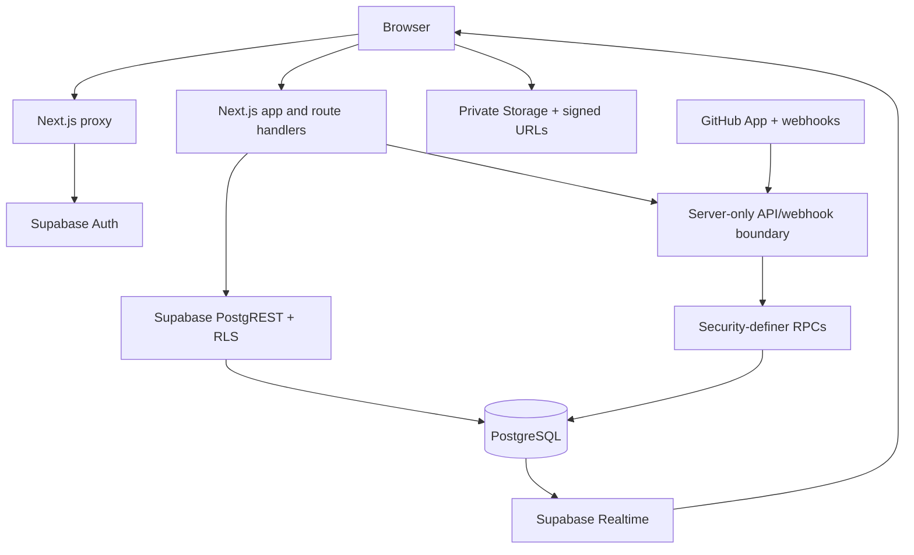

# TraceBox

TraceBox is a focused issue-tracking workspace for engineering teams. It turns an incoming defect into structured, permission-aware work with a clear lifecycle from report to triage, implementation, and release. The product combines a dense developer queue with the controls teams need in production: roles, workflows, audit history, restricted issues, planning metadata, notifications, analytics, and GitHub development context.

<p align="center">
  <a href="https://trace-box.vercel.app/"></a>
  <a href="https://github.com/ExistedYear/TraceBox/actions/workflows/ci.yml"></a>
  <a href="https://github.com/ExistedYear/TraceBox"></a>
</p>

<p align="center"><strong><a href="https://trace-box.vercel.app/">Open the live application →</a></strong></p>

## Product overview

TraceBox is built for teams that need more than a list of tickets. Each issue has an auditable history, explicit ownership, workflow rules, searchable context, and access controls that continue through comments, attachments, notifications, reports, APIs, and realtime updates.

## Technology

<p>
  
  
  
  
  
</p>

The application uses the Next.js App Router, TypeScript, Tailwind CSS, shadcn/ui-style primitives, Lucide, Zod, React Hook Form, Supabase PostgreSQL/Auth/Storage/Realtime, and GitHub App APIs. Vitest, Playwright, pgTAP, and GitHub Actions provide the verification layers.

## Feature matrix

| Area | What is included | Product guarantee |
|---|---|---|
| Workspaces & projects | Workspaces, projects, switchers, invitations, contributors, roles, ownership transfer | Membership and project context are revalidated server-side; invitation tokens are hashed and single-use |
| Project administration | Metadata, immutable keys, archive/restore, components, default assignees, labels, versions, milestones | Archived projects reject mutations; workflow graphs publish atomically with structural validation |
| Issue lifecycle | Atomic creation, `KEY-N` numbering, full editing, templates, custom fields, planning, visibility, grants | Concurrent numbering is gap-safe; stale edits are rejected; creation options commit in one transaction |
| Issue queue | Search, combined filters, sorting, pagination, counts, saved views, inline edits, bulk updates | Queries are database-bounded, URL-stable, permission-checked, and visibility-aware |
| Workflow & triage | Role-aware transitions, resolutions, reopen, assignment, duplicate suggestions, J/K/A/R/D triage | Invalid transitions and duplicate resolution fail atomically with auditable outcomes |
| Collaboration | Comments, Markdown, stable mentions, activity timeline, watchers, notifications | Only persisted identity mentions style/notify; notification feeds redact inaccessible issues |
| Relationships | `BLOCKS`, `DEPENDS_ON`, `RELATES_TO`, `DUPLICATE_OF`, `CAUSED_BY`, `REGRESSION_OF` | Self-links, duplicates, unauthorized targets, and unsafe unlinking are rejected |
| Security & files | Restricted issues, access grants/history, private attachments, signed previews/downloads, orphan cleanup | `can_view_issue` and active-project checks protect every issue-owned surface and Storage object |
| Reports & readiness | Dashboard metrics, backlog history, MTTR, age/breakdowns, CSV export, readiness score and snapshots | Aggregates are backend-authoritative, visibility-filtered, explainable, and bounded |
| GitHub App | Verified installations, repository bindings, PR/check metadata, webhooks, auto-links, retries, reconciliation | Stable IDs, signed/idempotent deliveries, branch-aware resolution, and server-only credentials |
| REST API | `/api/v1` projects, issues, comments, milestones, search, and GitHub resources | Granular organization-scoped tokens; SQL-enforced scopes, membership, visibility, and safe errors |
| Account & UI | Profile/avatar, password/recovery, session controls, themes, command palette, responsive/accessibility support | Auth-sensitive writes stay in Auth; keyboard actions have visible equivalents and failure states are explicit |

## Feature catalog

### Workspace and project administration

- Create multiple workspaces and projects with cookie-backed workspace/project switching and server-side membership revalidation.
- Invite workspace and project contributors with hashed, single-use invitation tokens, explicit organization/project roles, pending-invite visibility, safe expiry/revocation handling, and ownership transfer with last-owner protection.
- Manage project metadata, immutable project keys, archive/restore lifecycle, components, default assignees, labels, versions, milestones, and contributor access.
- Publish a complete workflow graph atomically. Validation enforces one initial state, reachability, terminal paths, valid roles/transitions, and safe handling of in-use states.

### Issue lifecycle and queue

- Create issues atomically with human-readable keys such as `BUG-123`; number allocation is gap-safe under concurrent submissions.
- Capture title, Markdown description, type, priority, severity, environment, reproduction steps, expected/actual behavior, component, assignee, reporter, visibility, labels, versions, milestones, templates, and custom fields.
- Apply template defaults, required custom-field validation, component-assignee defaults, watchers, restricted grants, and audit events in one transaction.
- Edit full issue content with optimistic `updated_at` conflict detection, nullable-field clearing, unsaved-draft protection, Markdown preview, and field-level audit entries.
- Use the issue queue with combined status/category/priority/severity/type/visibility/component/assignee/reporter/resolution/version/milestone/label/custom-field filters, sorting, exact counts, pagination, URL state, and responsive desktop/mobile layouts.
- Perform bounded, permission-checked, atomic bulk updates with clear selection and failure recovery.
- Use a dedicated security queue and restricted indicators without exposing unauthorized issue metadata.

### Workflow, triage, and relationships

- Transition issues through the configured workflow with role checks, resolution requirements, reopen support, archived-project guards, and safe assignment/unassignment.
- Triage from a focused inbox with visible controls and J/K navigation plus A/R/D classification shortcuts that ignore text inputs and remain keyboard-accessible.
- Find likely duplicates while typing and resolve a duplicate atomically: deterministic locking, canonical issue linking, status/resolution update, and audit history happen together.
- Link issues as `BLOCKS`, `DEPENDS_ON`, `RELATES_TO`, `DUPLICATE_OF`, `CAUSED_BY`, or `REGRESSION_OF`, with reciprocal rendering, authorization, self-link prevention, duplicate detection, and safe unlink auditing.

### Collaboration and activity

- Add and edit 1–10,000-character comments through RPCs with project-member authorization, archived-project guards, safe GitHub-Flavored Markdown, code blocks, issue references, and XSS-safe rendering.
- Mention real project/issue identities through scoped autocomplete. Persisted mentions—not arbitrary `@text`—drive styling and notifications, including restricted-issue redaction.
- View one chronological timeline that merges issue events and comments, including creation, edits, transitions, assignments, links, planning changes, access changes, and comment activity.
- Watch and unwatch issues idempotently. Preference-aware notifications cover mentions, assignments, comments, status changes, watched updates, links, labels, planning, and milestones.
- Use the header preview and full cursor-paginated notification inbox with read-one/read-all state, explicit loading/error/empty states, and access-safe redaction.

### Search, saved views, and command workflows

- Search issue text using PostgreSQL `pg_trgm` and `tsvector` indexes, with database-side authorization and bounded results.
- Save and share stable issue views with `PRIVATE`, `PROJECT`, or `ORGANIZATION` visibility. Owners control lifecycle; RLS controls who can read shared views.
- Open a command palette for personal issues, notifications, project navigation, issue creation/search, and authorized quick status actions.
- Preserve filter state in canonical URL codecs so refresh, back/forward navigation, and shared links remain predictable.
- Subscribe to project-scoped Supabase Realtime channels for issue, comment, notification, and attachment changes; refetch visibility-sensitive updates and protect dirty drafts during reconnects.

### Files, security, and audit

- Upload private issue attachments up to 50 MB with validated names/types/paths, retryable failures, signed previews/downloads, image lightboxes, deletion, and protected orphan reconciliation.
- Store objects at `<issue-uuid>/<filename>` and require current issue visibility plus an active project for every Storage operation.
- Create restricted security issues with explicit access grants. RLS applies consistently to issues, comments, events, links, notifications, attachments, searches, saved views, reports, readiness, APIs, and realtime.
- Browse immutable, paginated project audit history with actor/action/date/issue filters, restricted-safe redaction, and CSV export.

### Reports, dashboard, and release readiness

- View backend-authoritative operational metrics for visible issues, created/resolved history, backlog trends, MTTR, age distribution, and assignee/component/priority/milestone breakdowns.
- Drill from reports to canonical queue filters and export bounded CSV data without bypassing issue visibility.
- Calculate an explainable 0–100 release-readiness score with factor-level risk lists, milestone/version validation, historical snapshots, and creator-private snapshot history.
- Keep dashboard aggregates honest with distinct loading, empty, not-found, failure, and retry states.

### GitHub App integration

- Connect a verified GitHub App installation separately from GitHub sign-in; callback state is signed and bound to the TraceBox user, workspace, and project.
- Discover repositories through stable GitHub IDs, bind multiple repositories to projects, select a primary repository explicitly, configure target branches, and control automation by repository.
- Search and link pull requests only from repositories bound to the active project. Fetch authoritative PR metadata and checks server-side.
- Receive signed, durable, idempotent webhooks with delivery leases, classified failures, replay/retry limits, lifecycle reconciliation, payload cleanup, and safe operational history.
- Derive `Fixes`/`Closes`/`Resolves` relationships transactionally, preserve manual links, and resolve issues only when the configured branch and visibility rules allow it.

### REST API and accounts

- Use organization-scoped bearer tokens with granular project, issue, comment, milestone, search, integration, and GitHub-link scopes.
- Access paginated project/issue reads and writes, comments, milestones, search, and verified GitHub resources through `/api/v1`; malformed input, insufficient scope, archived projects, and hidden issues return safe responses.
- Enforce token-owner live project membership and restricted issue visibility inside service-role-only SQL wrappers before data reaches route handlers.
- Manage profile/display name, owner-scoped avatar storage, email/password changes, recovery, notification preferences, current-session logout, and global logout from the account area.

### Interface and accessibility

- Use a dense command-center layout with sticky, scrollable navigation, responsive issue cards/tables, compact controls, semantic status labels, and explicit field labels.
- Support keyboard-only navigation, visible equivalents for shortcuts, focus-safe menus/dialogs, announced validation and failure states, reduced reliance on color, and mobile layouts at narrow viewports.
- Persist light/dark mode independently from blue, neutral, amber, purple, and emerald accent themes.

## What makes it dependable

- PostgreSQL and RLS are the source of truth. Privileged mutations are narrow SQL RPCs, not unrestricted browser writes.
- `can_view_issue` is the shared visibility boundary for issue-owned data, including restricted comments, files, notifications, analytics, API responses, and realtime behavior.
- Issue numbers are allocated atomically; workflow publication and duplicate resolution are transactional; audit history is immutable.
- Server-only service-role access is confined to API, webhook, and protected maintenance boundaries.
- Forward-only migrations preserve deployed history. The current chain contains 79 ordered migrations and the linked Supabase project is reconciled through migration 079.

## Architecture



Browser components use a typed Supabase client for authorized reads and RPC calls. Server components resolve the authenticated workspace/project context from validated cookies. Service-role credentials never enter client code.

## Run locally

Requirements: Node.js 22+, npm, and the Supabase CLI.

```bash
npm install
cp .env.example .env.local
# Add Supabase URL and publishable/anon key; add server-only values for API/GitHub routes.
npm run db:start
npm run db:reset
npm run dev
```

Open [http://localhost:3000](http://localhost:3000). A clean database reset intentionally has no synthetic tenant data; create a disposable workspace and project through the onboarding flow.

## Verification

```bash
npm run lint
npm run typecheck
npm test
npm run build
npm run check:migrations
npm run test:e2e
```

The verified release candidate passes the JavaScript quality gates, 204 Vitest checks, production build, contiguous migration/full-schema check, and credential-free browser smoke. GitHub Actions run `33264345126` additionally passed a fresh 001–079 Supabase replay, 231 pgTAP assertions, true concurrent issue allocation, production build, and browser smoke. Authenticated multi-user/provider journeys remain environment-gated because they require real deployment credentials.

## Deployment

The live deployment is [trace-box.vercel.app](https://trace-box.vercel.app/). For a new environment:

1. Create a Supabase project and apply the ordered migrations through 079.
2. Configure Auth site/redirect URLs, private attachment Storage, Realtime publication, and the required Vercel variables.
3. Configure the GitHub App callback, webhook, permissions, and server-only secrets if GitHub integration is enabled.
4. Connect the repository to Vercel and deploy the `main` branch.
5. Run the authenticated, two-user, Storage, Realtime, API, and webhook checks against the deployed environment.

See the [deployment guide](docs/deployment.md), [feature checklist](docs/feature-testing-checklist.md), [REST API contract](docs/api.md), and [handoff record](handoff.md). The deployment guide contains the exact variables, migration order, cron routes, Auth settings, Storage checks, and hosted validation steps.

## Documentation map

The active documentation set is intentionally small:

- [Deployment guide](docs/deployment.md) — setup, configuration, migration discipline, and release checks.
- [Feature checklist](docs/feature-testing-checklist.md) — the product QA matrix for a real workspace/project.
- [REST API](docs/api.md) — authentication, scopes, endpoints, pagination, and error contracts.
- [Schema decisions](docs/schema-decisions.md) — deliberate differences between historical plans and the shipped schema.
- [Handoff](handoff.md) — current verification evidence and operational context.

Historical audits, completed implementation plans, release logs, and the excluded Trace Intelligence proposal are retained in [docs/archive](docs/archive/). The AI plan is not implemented or part of the current submission.

## License

No license has been declared yet. Add the project’s intended license before public redistribution.
