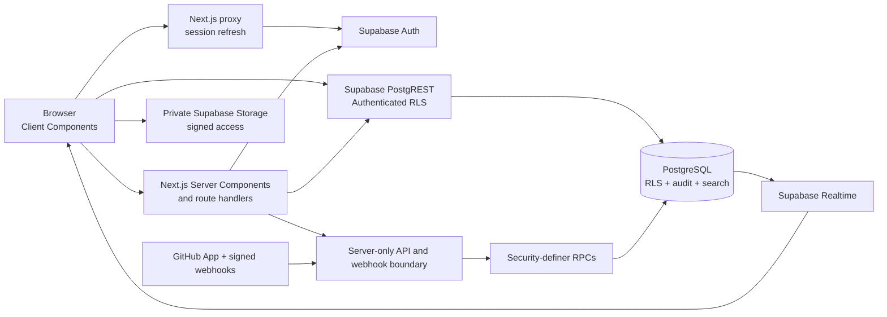

# TraceBox

TraceBox is a modern reconstruction of the problem Bugzilla solves: helping engineering teams turn incomplete defect reports into structured, authorized, auditable work that can move safely through triage, implementation, and release. It keeps the useful rigor of components, workflows, dependencies, versions, and immutable history while replacing the legacy interaction model with a dense, keyboard-friendly developer workspace.

**Live deployment:** [trace-box.vercel.app](https://trace-box.vercel.app/)

The current submission covers workspaces/projects, configurable workflows, issue lifecycle and collaboration, planning, notifications and realtime, advanced search and saved views, dependency and duplicate triage, private attachments, reports, release readiness, restricted security issues, GitHub App/PR automation, custom fields, and a scoped REST API.

## Why it is different

- **Release decisions, not vanity metrics:** the backend computes an explainable 0–100 readiness score from authorized issue state, with factor drilldowns, CSV export, and immutable snapshots.
- **Security issues stay secure:** one `can_view_issue` boundary protects issues and their comments, events, links, notifications, analytics, API results, realtime behavior, and private Storage objects.
- **Triage is an operational workflow:** the inbox combines visible A/R/D actions, J/K keyboard navigation, inline classification, deterministic duplicate suggestions, and one atomic duplicate-resolution transaction.
- **GitHub is verified and recoverable:** a separate GitHub App provides stable repository bindings, authoritative PR metadata and checks, signed/idempotent webhooks, derived auto-links, branch-aware resolution, retry/reconciliation, and payload-free operational visibility.
- **Database rules remain authoritative:** privileged writes are narrow SQL RPCs under RLS, issue numbers allocate atomically, workflow graphs publish transactionally, and audit history is immutable.

## Architecture



Browser mutations use authenticated RPCs; service-role access is confined to server-only API, GitHub, reconciliation, and cleanup boundaries. Cookie-backed workspace/project selection is revalidated against current memberships on every server request. See [the deployment guide](docs/deployment.md), [schema decisions](docs/schema-decisions.md), and [REST contract](docs/api.md) for the detailed boundaries.

## Stack

- Next.js App Router, TypeScript, and Tailwind CSS
- shadcn/ui-style components with Lucide icons
- Supabase PostgreSQL, Auth, private Storage, and Realtime subscriptions
- Zod and React Hook Form for validated authentication forms
- Safe GFM rendering for issue descriptions and comments

## Local setup

1. Install Node.js 22 or newer and the [Supabase CLI](https://supabase.com/docs/guides/cli). Use `npx supabase ...` from the project directory for the CLI commands below.
2. Install dependencies with `npm install`.
3. Copy `.env.example` to `.env.local` and add the URL and anon key from Supabase. For the API, GitHub App, webhook, and scheduled reconciliation routes, also add the server-only variables listed in `.env.example`.
4. For local Supabase, run `npm run db:start`, then `npm run db:reset` to apply migrations and seed data.
5. Start the app with `npm run dev`, then open [http://localhost:3000](http://localhost:3000).

Included today: email/password signup, login, logout, session refresh, workspace and project onboarding, hashed workspace/project invitations, explicit contributor roles, ownership transfer, audited project metadata/archive/restore and atomic workflow publishing, atomic issue creation with templates/custom fields/restricted grants and human-readable IDs (`KEY-1`), full conflict-aware issue editing, live duplicate candidate search, an issue queue with advanced filters/sorting/pagination/inline editing/restricted indicators/authorized atomic bulk updates, an audited issue detail page with unified activity timeline, project-member comments, workflow transitions and assignments, labels/versions/milestones, a preference-aware cursor-paginated notification inbox, realtime queue/detail updates with draft-conflict protection, explicit-visibility saved views with stable links and full lifecycle controls, issue links and transactional duplicate resolution, focus-safe triage classification shortcuts, private attachments with signed URLs, a dedicated restricted security queue and access history, reports/MTTR/age analytics, release readiness scoring, a command palette with personal/project/notification/status actions, issue templates, verified GitHub App repository connections, repository-bound PR search and rich development cards with CI summaries, normalized PR/commit artifacts, durable signed webhooks with atomic claim/replay and lifecycle handling, derived automatic-link reconciliation, classified GitHub errors, token caching, explicit primary repositories, an Active/Needs attention/History GitHub operations dashboard with per-repository automation controls, custom fields with issue values, scoped API tokens, and authenticated REST endpoints.

The header palette supports independent accent themes (blue by default, neutral, amber, purple, and emerald) while preserving the light/dark mode and semantic status colors.

The authenticated REST surface, token scopes, examples, and error contract are documented in [`docs/api.md`](docs/api.md). Before release, use [`docs/deployment-changes.md`](docs/deployment-changes.md) for required operator changes and [`docs/feature-testing-checklist.md`](docs/feature-testing-checklist.md) for the submission QA pass.

## Database workflow

Create a migration for every schema change, test it locally, commit it, and apply it to the linked project with `supabase db push`. Regenerate TypeScript types with `npm run db:types` after local schema changes or `npm run db:types:linked` after linking to a hosted project. Do not bypass RLS or make untracked production-only schema changes.

`supabase/migrations/` holds 79 ordered migrations. Migrations 042–064 cover GitHub reliability, completion-plan closure, analytics, collaboration, and operational visibility. Migrations 065–074 are forward-only live-schema reconciliations and invitation/GitHub confidentiality repairs. Migrations 075–079 move public API list/search authorization and bounding into SQL, correct the live search expression forward-only, restrict profile/GitHub catalogs to authorized tenant collaborators, enforce the token owner's live project membership, make issue visibility total, and revoke residual browser DML from RPC-owned tables. Regenerate `supabase/full_schema.sql` after every migration change. Because Supabase does not re-run an applied version when its file changes, compare the linked ledger and live catalog before every push and repair drift with a new migration.

## Quality checks

```bash
npm run lint
npm run typecheck
npm test
npm run build
npm run check:migrations
```

Current evidence on 2026-08-29: TypeScript and the production build pass; 204 Vitest checks pass across 38 files; the 79-file migration chain and generated full schema are synchronized; credential-free Playwright smoke passes 3/3 journeys; and linked Supabase dry-run/lint report an up-to-date ledger with zero public-schema errors. GitHub Actions run `33264345126` also passed a fresh disposable replay through migration 079, 231 pgTAP assertions, true concurrent issue-number allocation, the production build, and browser smoke. Fixture-dependent multi-user journeys remain explicit hosted release checks rather than being silently replaced by mocks.

## Judge demo flow

This path demonstrates the core product in roughly 90 seconds with any prepared workspace/project:

1. Open **Issues**, apply two filters, and save the result as a shareable project view.
2. Create an issue with a template, component default assignee, planning metadata, and a restricted visibility grant; open the resulting `KEY-N` issue.
3. Add a Markdown comment with a stable identity mention, then show the merged comment/audit timeline and notification inbox.
4. Open **Triage**, classify an issue with the visible controls or J/K/A/R/D shortcuts, inspect duplicate candidates, and resolve one duplicate atomically.
5. Open **Reports** and **Readiness** to show authoritative history, drilldowns, export, score factors, and a saved readiness snapshot.
6. Open **GitHub integrations** to show verified repositories and operational health, then open an issue's rich PR card with relationship, branches, state, and check summary.
7. Finish with **Security** or **Audit** to show restricted-safe access history and the immutable project event explorer.

The demo does not require AI or an uncommitted local environment file. GitHub-specific steps require the documented App variables and an installed repository; the rest of the product remains usable when GitHub is unavailable.

## CloneFest rubric evidence

| Category | Evidence in TraceBox |
|---|---|
| Problem understanding and core functionality | Complete structured defect lifecycle: organizations/projects, roles, components, workflows, issues, comments, planning, assignment, notifications, search, relationships, attachments, analytics, and API access. |
| Innovation and differentiation | Explainable release-readiness engine, restricted issue model applied across every data surface, keyboard-first triage, atomic duplicate resolution, stable mention identities, and recoverable GitHub development intelligence. |
| Technical implementation and architecture | Next.js server/client boundaries, generated Supabase types, permanent RLS, narrow transactional RPCs, immutable audit history, atomic issue allocation, private signed Storage, forward-only migration discipline, and durable HMAC webhooks. |
| User experience and accessibility | Dense responsive shell, explicit labels, visible non-keyboard equivalents, command palette, focus-safe shortcuts, loading/empty/error/retry states, light/dark plus independent accents, and semantic status text. |
| Performance, reliability, and demo quality | Database-side pagination/search/filtering, indexed reporting, bounded API reads, optimistic conflict detection, realtime refetch on visibility-sensitive events, webhook leases/replay, concurrent allocator verification, and failure-aware UI cleanup. |
| Documentation and explanation | This overview plus [operator changes](docs/deployment-changes.md), [feature QA](docs/feature-testing-checklist.md), [full deployment](docs/deployment.md), [REST API](docs/api.md), [schema decisions](docs/schema-decisions.md), and [handoff evidence](handoff.md). |

## Honest limitations

- In-app notification delivery is implemented; email notification delivery is intentionally not advertised or queued.
- API tokens are organization-scoped and follow their owner's live project memberships. There is no request-history explorer or promised application-level rate limit.
- The committed browser suite keeps multi-user/provider journeys environment-gated. Those flows must be run against the actual hosted Auth, Storage, Realtime, and GitHub configuration before submission.
- Trace Intelligence/AI is future scope reviewed in [the last-day plan audit](docs/last-day-plan-audit.md); it is not implemented or advertised in the current product.
- `supabase/seed.sql` is intentionally empty so clean resets never create synthetic tenant data. Demo fixtures should be created explicitly in a disposable or dedicated demo environment.

## Deploying

Push this repository to GitHub and connect it to Vercel with the Next.js preset. Configure the Supabase variables, GitHub App variables, `SUPABASE_SERVICE_ROLE_KEY`, `GITHUB_WEBHOOK_SECRET`, and `CRON_SECRET` as non-public server variables. The GitHub App private key and client secret must never enter client code. See `docs/deployment.md` for the full setup and verification sequence.

Apply all migrations before testing production signup. Configure Supabase Auth URLs, the private `issue-attachments` Storage bucket/policies, the `supabase_realtime` publication, the GitHub App callback/webhook, and Vercel server environment variables before the live end-to-end flow. Vercel invokes `/api/github/reconcile` once daily at 03:00 UTC using `CRON_SECRET`; that job also replays eligible webhook deliveries and clears expired payloads. Failed webhook deliveries stop after eight processing attempts and remain available as metadata for cleanup/diagnostics. Protected `/api/attachments/reconcile` also requires `CRON_SECRET` and must be invoked manually or by a separately scheduled job; it is not included in the existing Vercel cron. The standalone replay and cleanup endpoints use the same secret for manual operations.

GitHub Actions runs migration consistency, lint, typecheck, unit/API/webhook/realtime tests, the production build, disposable-Supabase replay/pgTAP/concurrency checks, and credential-free Playwright smoke on pull requests and pushes to `main`. No GitHub App environment files are required for tests. Vercel's Git integration owns deployments, so no duplicate Vercel deployment workflow or Vercel token is required.

## Live QA

The committed `playwright/` harness runs public/authentication smoke without credentials and exposes explicitly gated multi-user journeys for a seeded deployment. Reports, browser state, and environment files are ignored. GitHub route/webhook coverage is credential-free and does not need GitHub App env files. An older ignored `qa/live/` suite remains optional for deployment-specific probes; never commit its secrets or generated artifacts.

## Verified release paths

As of 2026-08-28, the hosted GitHub App flow has been manually verified with a private repository: installation callback, repository discovery, project binding, signed pull-request webhook delivery, automatic PR linking, and `Fixes <PROJECT_KEY>-<NUMBER>` resolution after merging into `main`. Issue keys use the selected TraceBox project's key (for example, `BUG-1`), not the workspace name. Apply migrations through 079 before using the current application contracts.

The desktop sidebar is viewport-height and scrollable; its Settings and Contributors links remain reachable on short screens or when the workspace switcher is large, and the navigation no longer renders a stray semicolon. Credential-free Playwright smoke is committed and locally verified; fixture-dependent multi-user journeys remain a hosted release check.
