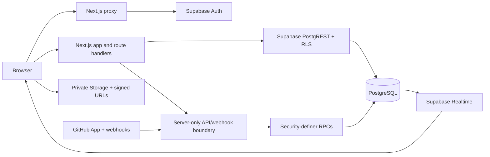

# TraceBox

TraceBox is a focused issue-tracking workspace for engineering teams. It turns an incoming defect into structured, permission-aware work with a clear lifecycle from report to triage, implementation, and release. The product combines a dense developer queue with the controls teams need in production: roles, workflows, audit history, restricted issues, planning metadata, notifications, analytics, and GitHub development context.

<p align="center">
  <a href="https://trace-box.vercel.app/"></a>
  <a href="https://github.com/ExistedYear/TraceBox/actions/workflows/ci.yml"></a>
  <a href="https://github.com/ExistedYear/TraceBox"></a>
</p>

<p align="center"><strong><a href="https://trace-box.vercel.app/">Open the live application →</a></strong></p>

## Product overview

TraceBox is built for teams that need more than a list of tickets. Each issue has an auditable history, explicit ownership, workflow rules, searchable context, and access controls that continue through comments, attachments, notifications, reports, APIs, and realtime updates.

The current product includes:

- Workspaces, projects, contributors, invitations, ownership transfer, project administration, and configurable workflows.
- Atomic issue creation and conflict-aware editing with templates, custom fields, labels, versions, milestones, assignees, and restricted visibility.
- A dense, responsive issue queue with filtering, sorting, pagination, saved views, inline editing, bulk updates, and realtime consistency.
- Comments, stable identity mentions, unified activity timelines, watchers, preference-aware notifications, issue links, duplicate detection, and keyboard-first triage.
- Private attachments with signed access, restricted security queues, immutable access history, reports, MTTR/age analytics, and explainable release-readiness scoring.
- A verified GitHub App integration with repository bindings, PR metadata and checks, signed durable webhooks, branch-aware resolution, retries, reconciliation, and operational visibility.
- Scoped REST API endpoints with organization-bound tokens and database-enforced authorization.

## What makes it dependable

- PostgreSQL and RLS are the source of truth. Privileged mutations are narrow SQL RPCs, not unrestricted browser writes.
- `can_view_issue` is the shared visibility boundary for issue-owned data, including restricted comments, files, notifications, analytics, API responses, and realtime behavior.
- Issue numbers are allocated atomically; workflow publication and duplicate resolution are transactional; audit history is immutable.
- Server-only service-role access is confined to API, webhook, and protected maintenance boundaries.
- Forward-only migrations preserve deployed history. The current chain contains 79 ordered migrations and the linked Supabase project is reconciled through migration 079.

## Technology

<p>
  
  
  
  
  
</p>

The application uses the Next.js App Router, TypeScript, Tailwind CSS, shadcn/ui-style primitives, Lucide, Zod, React Hook Form, Supabase PostgreSQL/Auth/Storage/Realtime, and GitHub App APIs. Vitest, Playwright, pgTAP, and GitHub Actions provide the verification layers.

## Architecture



Browser components use a typed Supabase client for authorized reads and RPC calls. Server components resolve the authenticated workspace/project context from validated cookies. Service-role credentials never enter client code.

## Run locally

Requirements: Node.js 22+, npm, and the Supabase CLI.

```bash
npm install
cp .env.example .env.local
# Add Supabase URL and publishable/anon key; add server-only values for API/GitHub routes.
npm run db:start
npm run db:reset
npm run dev
```

Open [http://localhost:3000](http://localhost:3000). A clean database reset intentionally has no synthetic tenant data; create a disposable workspace and project through the onboarding flow.

## Verification

```bash
npm run lint
npm run typecheck
npm test
npm run build
npm run check:migrations
npm run test:e2e
```

The verified release candidate passes the JavaScript quality gates, 204 Vitest checks, production build, contiguous migration/full-schema check, and credential-free browser smoke. GitHub Actions run `33264345126` additionally passed a fresh 001–079 Supabase replay, 231 pgTAP assertions, true concurrent issue allocation, production build, and browser smoke. Authenticated multi-user/provider journeys remain environment-gated because they require real deployment credentials.

## Deployment

The live deployment is [trace-box.vercel.app](https://trace-box.vercel.app/). For a new environment:

1. Create a Supabase project and apply the ordered migrations through 079.
2. Configure Auth site/redirect URLs, private attachment Storage, Realtime publication, and the required Vercel variables.
3. Configure the GitHub App callback, webhook, permissions, and server-only secrets if GitHub integration is enabled.
4. Connect the repository to Vercel and deploy the `main` branch.
5. Run the authenticated, two-user, Storage, Realtime, API, and webhook checks against the deployed environment.

See the [deployment guide](docs/deployment.md), [feature checklist](docs/feature-testing-checklist.md), [REST API contract](docs/api.md), and [handoff record](handoff.md). The deployment guide contains the exact variables, migration order, cron routes, Auth settings, Storage checks, and hosted validation steps.

## Documentation map

The active documentation set is intentionally small:

- [Deployment guide](docs/deployment.md) — setup, configuration, migration discipline, and release checks.
- [Feature checklist](docs/feature-testing-checklist.md) — the product QA matrix for a real workspace/project.
- [REST API](docs/api.md) — authentication, scopes, endpoints, pagination, and error contracts.
- [Schema decisions](docs/schema-decisions.md) — deliberate differences between historical plans and the shipped schema.
- [Handoff](handoff.md) — current verification evidence and operational context.

Historical audits, completed implementation plans, release logs, and the excluded Trace Intelligence proposal are retained in [docs/archive](docs/archive/). The AI plan is not implemented or part of the current submission.

## License

No license has been declared yet. Add the project’s intended license before public redistribution.
